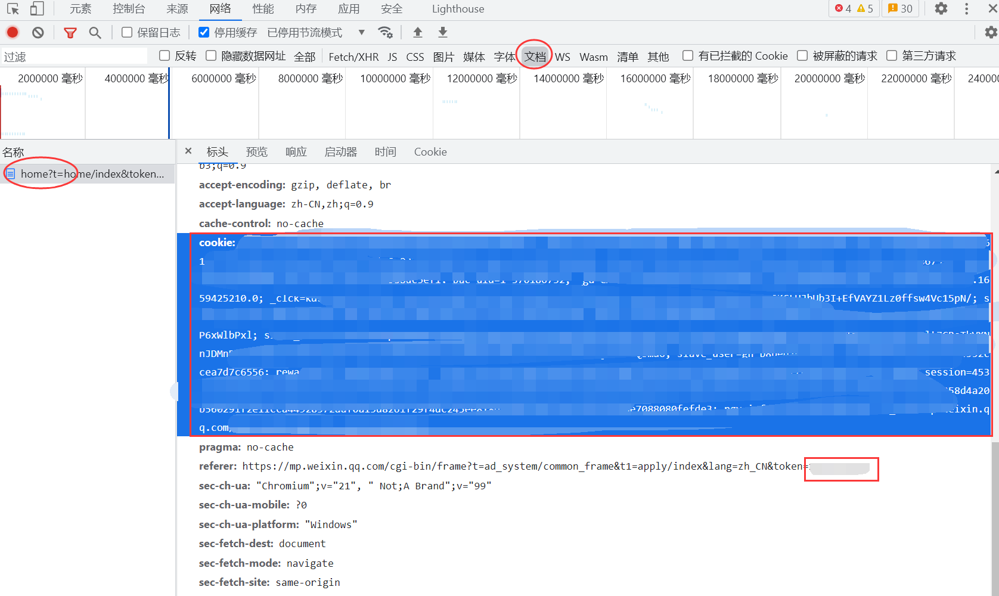

  
   
  

# nonebot-plugin-60s

_✨ 每天60秒读懂世界 ✨_

## 📖 介绍

  
效果图

## 💿 安装

使用 nb-cli 安装

在 nonebot2 项目的根目录下打开命令行, 输入以下指令即可安装

    nb plugin install nonebot-plugin-60s

使用包管理器安装

在 nonebot2 项目的插件目录下, 打开命令行, 根据你使用的包管理器, 输入相应的安装命令

pip

    pip install nonebot-plugin-60s

pdm

    pdm add nonebot-plugin-60s

poetry

    poetry add nonebot-plugin-60s

conda

    conda install nonebot-plugin-60s

打开 nonebot2 项目的 `bot.py` 文件, 在其中写入

    nonebot.load_plugin('nonebot_plugin_60s')

## 配置说明(可选)
有时候api会失效，就改了下
微信公众号地址：https://mp.weixin.qq.com/
抓取的是公众号的内容，我也就找了一个直接分享图片的公众号：每日60s简报（dailybriefing60s），也是很稳定的每天都会在8点前就会推送当天简报

先登陆你的公众号，因为我们要获取一些你的cookie以及token
登陆后F12查看请求

红圆框是可以找到的地方（大概），红方框就是cookie以及token(cookies:后面的才是，你也可以右键复制值，token=后面的才是)(这也不懂就使用默认吧)
| 配置项 | 说明 |
|:-----:|:----:|
| calendar_cookie: str = "" | 填写微信公众号的cookie |
| calendar_token: str = "" | 填写微信公众号的token |

## 🎉 使用
### 指令表
| 指令  | 说明 |
|:-----:|:----:|
| 60s/读懂世界 | 查看今天的60s日历 |
| 60s/读懂世界+设置 | 以连续对话的形式设置60s日历的推送时间 |
| 60s/读懂世界+设置 小时:分钟 | 设置60s日历的推送时间 |
| 60s/读懂世界+状态 | 查看本群的60s日历状态 |
| 60s/读懂世界+禁用 | 禁用本群的60s日历推送 |

## 💡 鸣谢

### [A-kirami摸鱼日历](https://github.com/A-kirami/nonebot-plugin-moyu)：本项目就是用大佬的项目改了几行代码，连说明文档也是（）